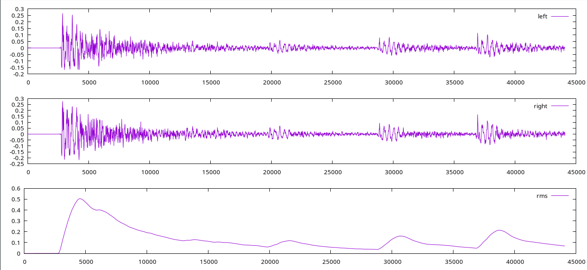

# 🌊 waver

## What is this?

Reading in a PCM 16 bit WAV file and processing the audio data, below is an example graph of how I'm testing my work.

## Build

`make`

## Show the test graph

`make plot`

## Example Graph

